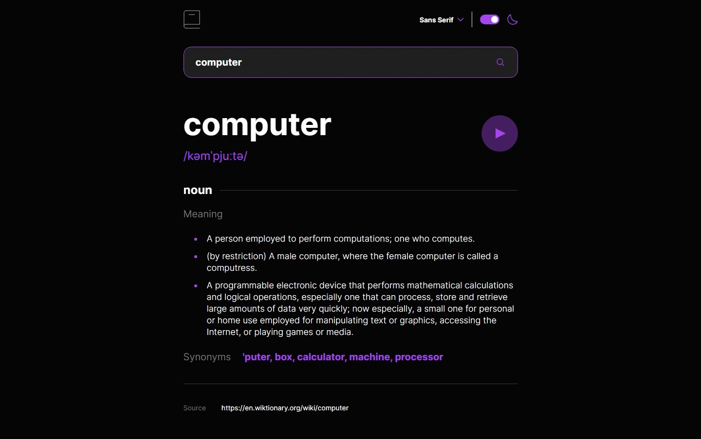
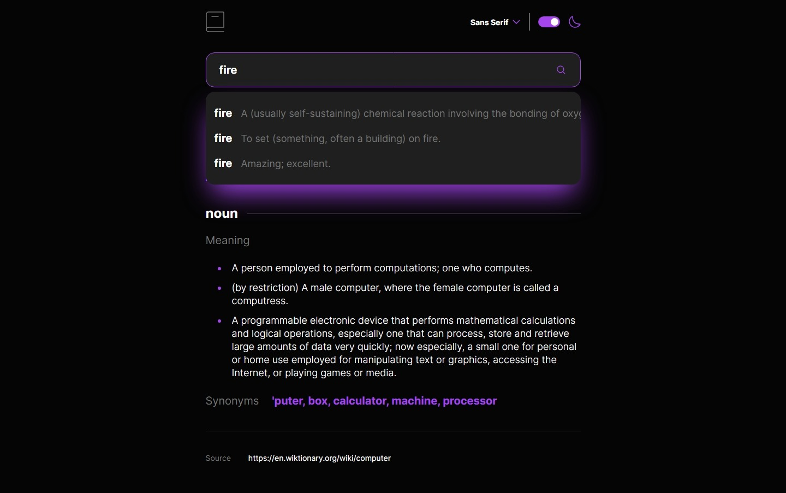

# Frontend Mentor - Dictionary web app solution

This is a solution to the [Dictionary web app challenge on Frontend Mentor](https://www.frontendmentor.io/challenges/dictionary-web-app-h5wwnyuKFL). Frontend Mentor challenges help you improve your coding skills by building realistic projects.

## Overview

### The challenge

Users should be able to:

- Search for words using the input field
- See the Free Dictionary API's response for the searched word
- See a form validation message when trying to submit a blank form
- Play the audio file for a word when it's available
- Switch between serif, sans serif, and monospace fonts
- Switch between light and dark themes
- View the optimal layout for the interface depending on their device's screen size
- See hover and focus states for all interactive elements on the page
- **Bonus**: Have the correct color scheme chosen for them based on their computer preferences. _Hint_: Research `prefers-color-scheme` in CSS.

### Screenshot

### Links

- Solution URL: [https://github.com/nikosetiawanp/dictionary-web-app](https://github.com/nikosetiawanp/dictionary-web-app)
- Live Site URL: [https://nikosetiawanp.github.io/dictionary-web-app/](https://nikosetiawanp.github.io/dictionary-web-app/)

## My process

### Built with

### What I learned

- I learned how to create a dropdown using vanilla React and implement my own custom logic to handle its behavior. The component can be found on `src/components/SearchBar.tsx`
  I realized that using a library like Radix could have simplified the behavior handling, making the code shorter and more maintainable.

### Continued development

The project has fulfilled its purpose as a learning exercise, so I don’t plan to extend it further.

### Useful resources

- [React Docs](https://react.dev/) - Served as a syntax refresher and reference for components
- [Tailwind Docs](https://tailwindcss.com/docs/installation/using-vite) - Guided me in styling and setting up Tailwind with Vite
- [Dictionary API](https://dictionaryapi.dev/) - Provided the word data used in the project

## Author

- Github - [Niko Setiawan P.](https://github.com/nikosetiawanp)
- Frontend Mentor - [@nikosetiawanp](https://www.frontendmentor.io/profile/nikosetiawanp)
